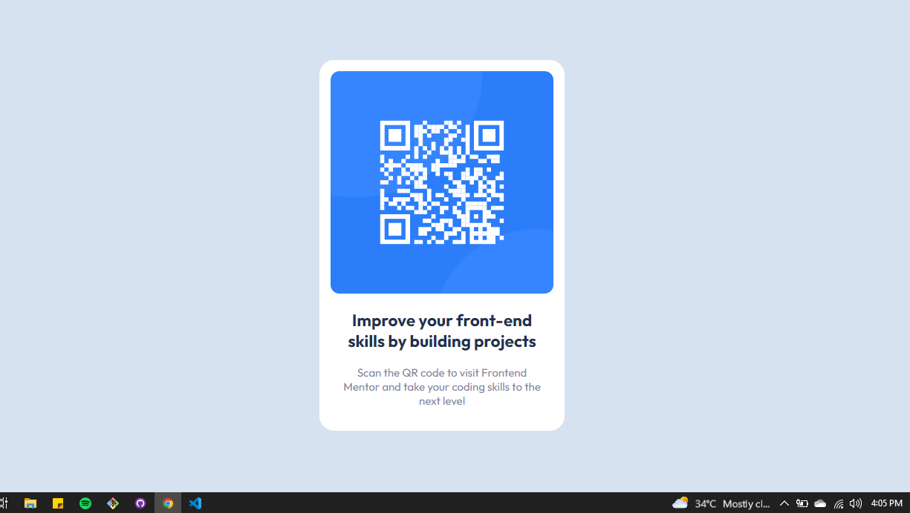

# Frontend Mentor - QR code component solution

This is a solution to the [QR code component challenge on Frontend Mentor](https://www.frontendmentor.io/challenges/qr-code-component-iux_sIO_H). Frontend Mentor challenges help you improve your coding skills by building realistic projects. 

## Table of contents

- [Overview](#overview)
  - [Screenshot](#screenshot)
  - [Links](#links)
- [My process](#my-process)
  - [Built with](#built-with)
  - [What I learned](#what-i-learned)
  - [Continued development](#continued-development)
- [Author](#author)

**Note: Delete this note and update the table of contents based on what sections you keep.**

## Overview

### Screenshot

### Links

- Solution URL: [solution](https://github.com/mbilal-x/frontendmentor__P2_qr-code-component-main)
- Live Site URL: [live site](https://mbilal-x.github.io/frontendmentor__P2_qr-code-component-main)

## My process
In the first commit i used flexbox for the solution. Then I changed it and used grid and then finally using position property.
### Built with

- HTML5 markup
- CSS custom properties
- Flexbox
- CSS Grid
- position property
- Mobile-first workflow

### What I learned

That grid is very confusing. I will just use bootstrap whenever i needed grid.(XP)

### Continued development

I do feel bad about not knowing how to use grid. I might look into it in the future.

-> which I did, and now I can say I have a good sense oh how and where to use display grid property.

## Author

- Website - [Muhammad Bilal](mohammadbilal.me)
- Frontend Mentor - [@mbilal-x](https://www.frontendmentor.io/profile/mbilal-x)
